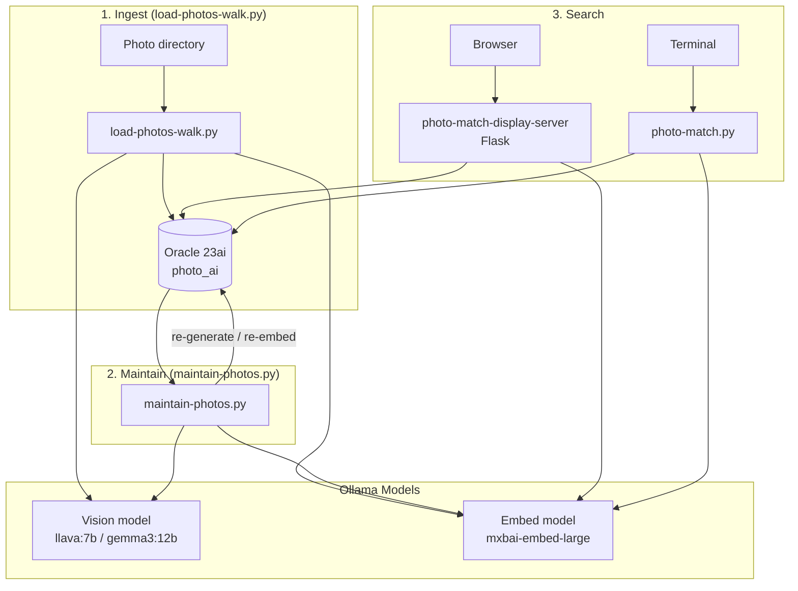
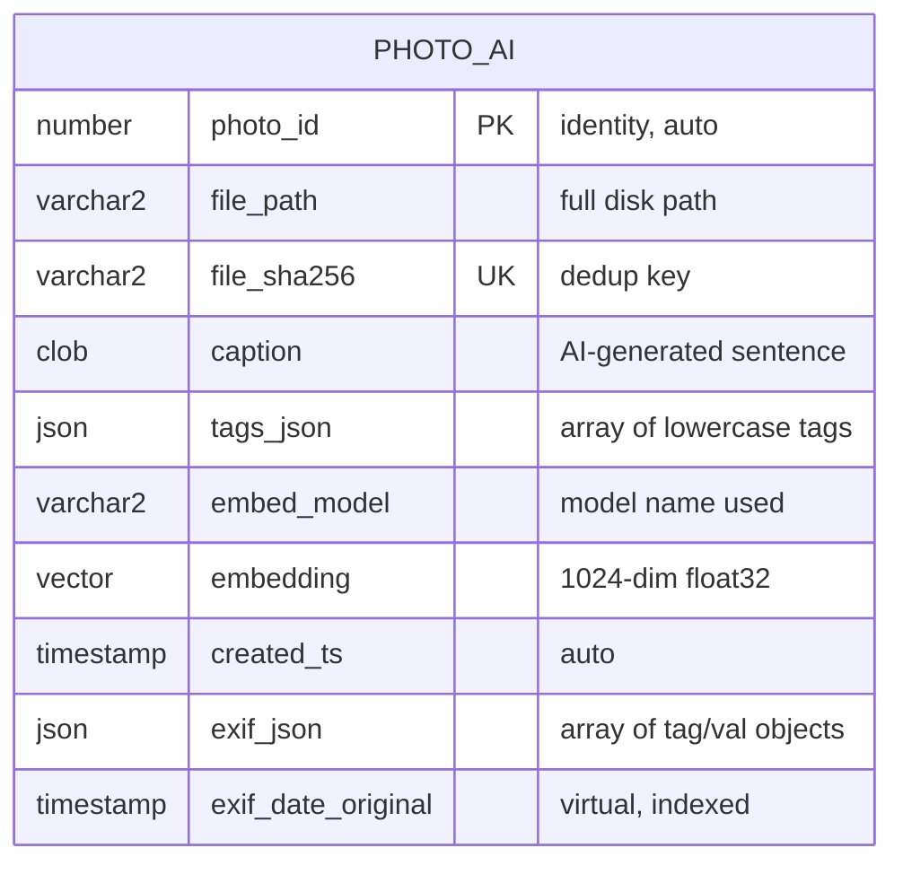
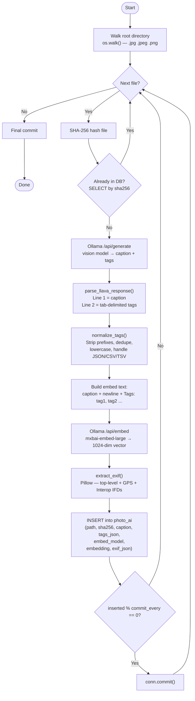
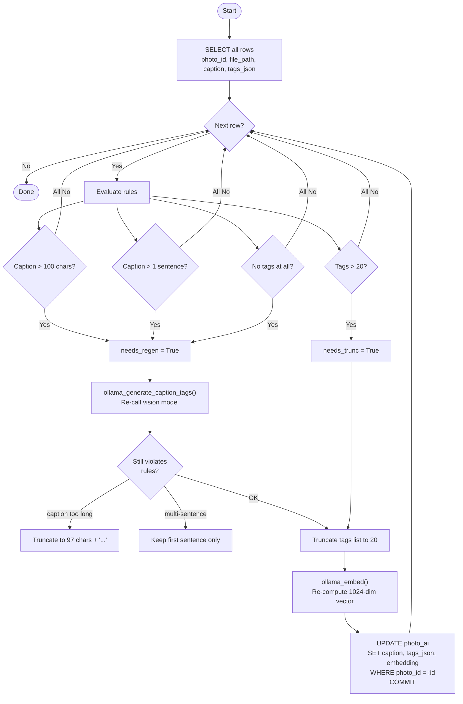
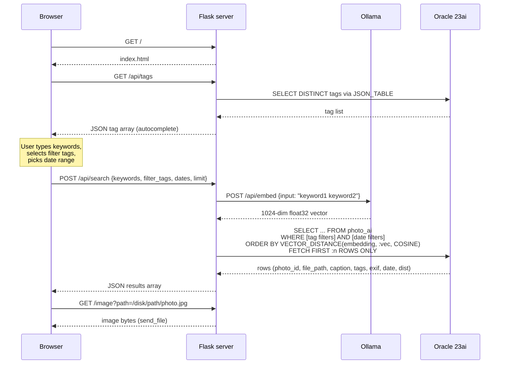
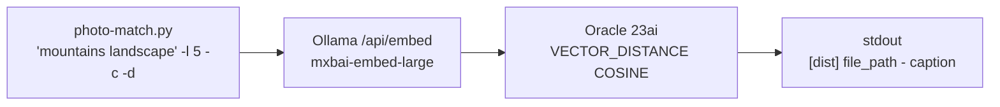
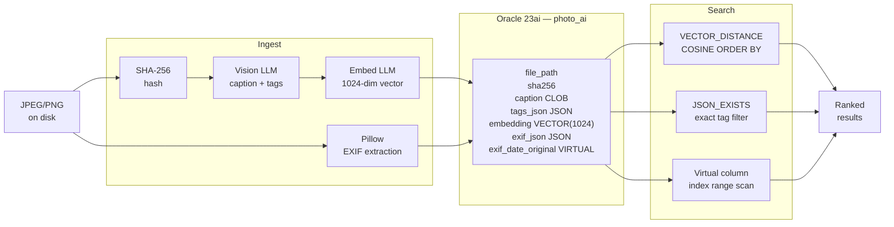

# Photo AI Scanner — End-to-End Flow

## System Overview



---

## Prerequisites

| Component | Requirement |
|---|---|
| Python | 3.12+ |
| Oracle DB | 23ai with Vector and JSON support |
| Ollama | Running locally or remotely |
| Ollama models | `llava:7b` (or `gemma3:12b`) + `mxbai-embed-large` |
| Python packages | `oracledb`, `requests`, `pillow`, `flask` |

---

## Step 0 — Database Setup

Run the DDL once before any photos are loaded.

```sql
sqlplus scott/tiger@server/pdb1.example.com @table-photo-ai.sql
```



`exif_date_original` is a **virtual column** derived from `exif_json` — it extracts the `DateTimeOriginal` EXIF field and converts it to a `TIMESTAMP`. A B-tree index on this column makes date-range queries instant.

---

## Step 1 — Photo Ingestion (`load-photos-walk.py`)



### Key behaviors

- **Dedup**: SHA-256 hash prevents reprocessing the same file, even if renamed or moved.
- **Retries**: Both vision and embed calls retry `--generate-retries` / `--embed-retries` times before logging and skipping.
- **Progress**: A dot is printed to the terminal every 10 files; errors go to `photo_loader_errors.log`.
- **Batch commits**: `--commit-every` (default 25) controls how often Oracle commits; the final commit runs unconditionally.

### Prompt sent to the vision model

```
Analyze the image and provide a caption and tags in ONLY two lines.
NO markdown. NO code fences. NO column headers.
DO NOT use prefixes like "Line 1:", "Caption:", or "Tags:".

Line 1: A single sentence describing the image.
Line 2: 12 to 20 lowercase tags separated by tabs.
```

---

## Step 2 — Maintenance (`maintain-photos.py`)

Run periodically to clean up rows where the LLM ignored the prompt rules.



`maintain-photos.py` dynamically imports `load-photos-walk.py` to reuse `ollama_generate_caption_tags`, `ollama_embed`, and `DEFAULT_PROMPT` exactly — no duplication.

---

## Step 3a — Web Search (`photo-match-display-server`)



### Search filters (combinable)

| Filter | Mechanism |
|---|---|
| Vector keywords | `VECTOR_DISTANCE(embedding, :vec, COSINE)` ORDER BY |
| Required tags | `JSON_EXISTS(tags_json, '$?(@ == $T)' PASSING :tag AS "T")` per tag |
| Date range | `exif_date_original BETWEEN :start AND :end` (uses virtual-column index) |
| Include undated | Toggle adds `OR exif_date_original IS NULL` |

### Web UI features

- **Autocomplete**: Tag input queries `/api/tags` on load; filters suggestions as you type.
- **Zoom modal**: Click any photo thumbnail to open a full-screen overlay.
- **EXIF modal**: "View EXIF Data" button renders all stored EXIF fields in a table.
- **File path toggle**: "Show file paths" reveals the absolute disk path on every card.
- **Sidebar toggle**: Collapsible sidebar for full-screen photo browsing on mobile.

---

## Step 3b — CLI Search (`photo-match.py`)



```bash
./photo-match.py "mountains landscape" -l 5 -c -d
```

```
[0.1245]  /mnt/photos/vacation/IMG_01.jpg  - A snowy mountain peak against a blue sky.
[0.1582]  /mnt/photos/vacation/IMG_05.jpg  - A lush green valley surrounded by tall mountains.
```

Flags: `-l` limit · `-c` show caption · `-d` show cosine distance score

---

## Data Flow Summary


